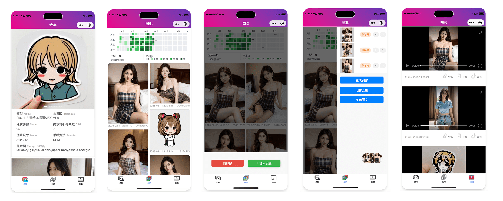

# 🎨AI Gallery

<!-- PROJECT LOGO -->
<p align="center">
  <a href="https://github.com/WYQilin/aigallery">
    
  </a>

  <h3 align="center">🎨奇绘图册</h3>
  <p align="center">
    一个AI绘画爱好者使用的图片管理小程序
    <br />
    <a href="https://github.com/WYQilin/aigallery">查看Demo</a>
    ·
    <a href="https://github.com/WYQilin/aigallery/issues">反馈</a>
    ·
    <a href="https://blog.csdn.net/qq_37788558/article/details/145499404">Blog</a>
    
</p>

> 此项目为服务端部分，小程序端参见：[服务端接口](https://github.com/WYQilin/aigallery-server)


### 🤩预览

### 3.1 截图示例

<div align="center">
    
</div>

### 3.2 在线体验

<div align="center">
    
</div>

- 由于视频类目不支持，demo中视频使用gif图片兼容
- 由于审核原因，只放了一点点普通图片
- 由于示例服务器带宽较低，可能加载稍慢

以上，敬请谅解～
> 您如果只是自用，且擦边内容较多，也可以考虑只发布到体验版，不上线到正式版。


### 📖项目介绍

#### 概述
奇绘图册是一款作者自用的AI绘画图片管理、展示工具。用于记录和分享画过的众多图片。

#### 背景
从2024年开始，玩了大半年stable diffusion，先后画了上万张图，有很强的分享欲和朋友交流作品。可惜离开电脑后无法有效翻阅自己的图片作品，为了和朋友交流和分享，用之前开发过的一个海报小程序快速改出了一套图片展示小程序，并建设了一套自动发布到社交平台的工作流，用着还算顺手。
趁着蛇年春节梳理了部分代码，开源一部分基础功能，希望同样玩AI绘画的朋友们也能通过此项目高效记录自己的作品并于他人分享。

#### 功能介绍
小程序部分主体分三个模块：图集、图池、视频。
- 图集：当提示词等参数不变时，生成的同一批图片视为一个图集，即prompt_hash相同的若干图片展示在一起，可查阅对应的画图参数。
- 图池：展示指定目录中的全部图片。指定图片目录后，系统自动维护里边的图片信息，生成类似github贡献热力图，可按日期查阅不同时期的图片风格。
- 视频：展示视频列表。可直接在图池页面选择多张图片自动合成简易的幻灯片式的轮播视频；也可使用文、图生视频的结果（作者Mac M3带不动图生视频，可以自己完善）

### 📦部署

1. 微信小程序下载即可用微信开发者工具打开
```
git clone https://github.com/WYQilin/aigallery
``` 
###
2. 搭配服务端接口使用：
见后端项目：https://github.com/WYQilin/aigallery-server
部署完成后即可使用

> tips: 由于AI绘图结果不完全可控，小程序内容审核可能有问题，可以只使用小程序体验版，不发布到线上，这样没有监管审核风险。
> 或指定图片目录时不直接使用SDwebui、Comfyui的保存目录，手动挑选高质量图片再复制/移动到项目目录中。

### 📃文件目录说明

```
├── README.md
├── app.js
├── app.json
├── app.wxss
├── assets #图片等静态资源
├── colorui #colorUI
│   ├── icon.wxss
│   └── main.wxss
├── components #组件
│   ├── bottom #底部统一组件
│   │   ├── bottom.js
│   │   ├── bottom.json
│   │   ├── bottom.wxml
│   │   └── bottom.wxss
│   ├── canvas-poster #canvas用来画分享图(todo)
│   │   ├── index
│   │   └── poster
│   └── templates #简易模版
│       ├── copyright.wxml
│       └── empty.wxml
├── pages #页面【主要关注】
│   ├── collection # 图集
│   │   ├── index.js
│   │   ├── index.json
│   │   ├── index.wxml
│   │   └── index.wxss
│   ├── videos # 视频
│   │   ├── index.js
│   │   ├── index.json
│   │   ├── index.wxml
│   │   └── index.wxss
│   └── waterfall # 图池
│       ├── index.js
│       ├── index.json
│       ├── index.wxml
│       └── index.wxss
├── project.config.json
├── sitemap.json
└── utils
    ├── http.js #API请求封装
    └── util.js

```

### 📧 联系作者
- 有问题和建议请提issue（首选）
- 通过小程序底部按钮可报bug和联系“客服”
- 可以关注我的[博客](http://xiaobaiqi.blog.csdn.net)并私信

### ©️License

该项目采用 [Apache-2.0 License](LICENSE) 授权许可，详情请参阅。

### 🔗鸣谢
小程序样式主要依赖以下项目，以表感谢～
- [ColorUI](https://github.com/weilanwl/coloruicss) 
- [Flaticon](https://www.flaticon.com/)


